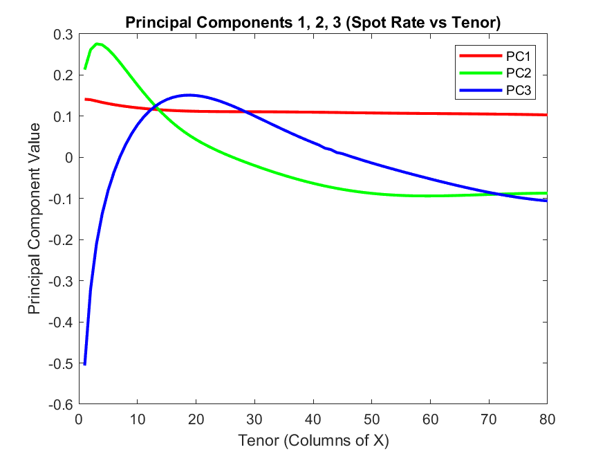
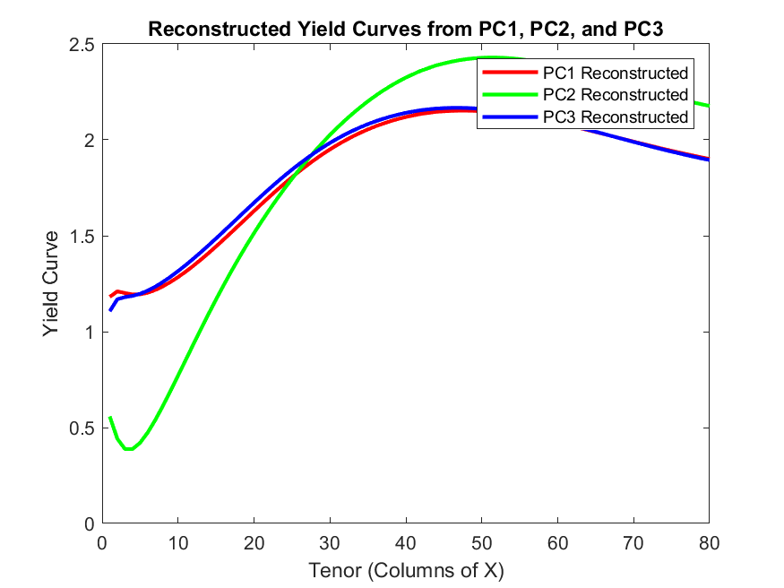
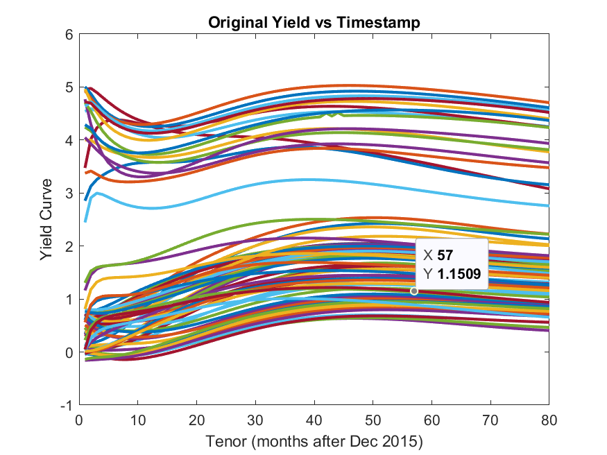
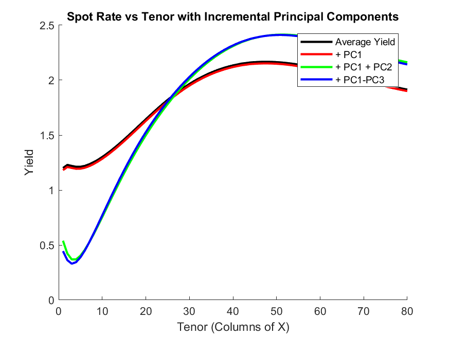

# Yield Curve Principal Component Analysis

This repository contains a MATLAB implementation of Principal Component Analysis (PCA) for yield curve modeling and visualization.

## Overview

This project applies PCA to yield curve data to identify the three main modes of variation, commonly interpreted as:
- **Level**: The overall height of the yield curve (PC1)
- **Slope**: The steepness of the yield curve (PC2)
- **Curvature**: The curvature or "humped-ness" of the yield curve (PC3)

These three components typically explain over 95% of the variation in yield curve movements.



## Features

- Loads and preprocesses yield curve data from Excel
- Performs PCA to extract principal components
- Visualizes the principal components and their effects
- Reconstructs yield curves using the principal components
- Demonstrates cumulative contribution of each PC to the yield curve

## Usage

1. Clone this repository
2. Place your yield curve data in Excel format in the repository directory
   - First column should contain identifiers or dates
   - Remaining columns should contain yield rates for different tenors
3. Update the file path in `yield_curve_pca.m` if needed
4. Run the script in MATLAB

```matlab
% Example usage
run yield_curve_pca.m
```

## Sample Visualizations

### Principal Components (Level, Slope, Curvature)


### Reconstructed Yield Curves


### Original Yield Curves


### Incremental Reconstruction


## Requirements

- MATLAB (tested on R2021a and later)
- Statistics and Machine Learning Toolbox (for some advanced functionality)

## Dataset

The example dataset `glc-yield-curve-data.xlsx` contains [you can add details about your dataset here].

## License

[Choose an appropriate license for your project, such as MIT, BSD, or GPL]

## Citation

If you use this code in your research, please cite:

```
@misc{yield-curve-pca,
  author = {Your Name},
  title = {Yield Curve Principal Component Analysis},
  year = {2025},
  publisher = {GitHub},
  journal = {GitHub repository},
  howpublished = {\url{https://github.com/yourusername/Yield-Curve-PCA}}
}
```

## Contributing

Contributions are welcome! Please feel free to submit a Pull Request.
